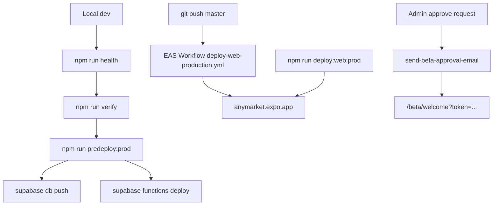

# AnyMarket (qbet) documentation

Central index for engineering, deploy, compliance, and product docs.

**Production URLs**

| Surface | URL |
|---------|-----|
| Web app | https://anymarket.expo.app |
| Supabase project | `jweyqlcvvmdyyqgqcsjd` |
| GitHub | https://github.com/rcdev714/qbet |
| Expo hosting | https://expo.dev/projects/5f9fbca3-cb6b-4b24-8918-2717c150019b |

---

## Start here

| Doc | Audience | Purpose |
|-----|----------|---------|
| [local-dev-verification.md](./local-dev-verification.md) | Engineers | Local setup, env vars, migrations, health checks, beta flow testing |
| [deploy-web-production.md](./deploy-web-production.md) | Engineers / release | EAS web deploy, GitHub auto-deploy, rollback |
| [deploy-beta-approval-notify.md](./deploy-beta-approval-notify.md) | Engineers / release | Resend email, Supabase secrets, approval flow end-to-end |
| [policy-security-framework.md](./policy-security-framework.md) | Engineers / compliance | Actor/context/action/evidence model, gates, ontology |
| [deploy-bet-contract-email.md](./deploy-bet-contract-email.md) | Engineers / release | Wager agreement emails via Resend |
| [ec-beta-e2e-checklist.md](./ec-beta-e2e-checklist.md) | QA / release | Manual E2E checklist before inviting beta users |
| [e2e-local.md](./e2e-local.md) | Engineers / QA | Automated local full-stack E2E (Playwright + Stripe) |

---

## Deploy and release pipeline



### npm scripts (release-related)

| Script | What it runs |
|--------|----------------|
| `npm run health` | typecheck, lint, unit tests, Deno email tests, policy hashes, hooks, SQL smoke (if Supabase local up) |
| `npm run verify` | `check:web:prod` + unit tests + Deno email tests |
| `npm run predeploy:prod` | `verify` + Supabase secrets/function/migration/Resend checks |
| `npm run deploy:web:prod` | verify via EAS env + `eas deploy --prod` |
| `npm run test:beta-approval-flow` | Local RPC: submit → approve → resolve (optional Resend with `RUN_BETA_EMAIL_TEST=1`) |

### Supabase (production)

```bash
npx supabase link --project-ref jweyqlcvvmdyyqgqcsjd
npx supabase db push
npx supabase functions deploy send-beta-approval-email
npx supabase secrets list
```

---

## Environment variables (summary)

Full matrix: [deploy-beta-approval-notify.md § env matrix](./deploy-beta-approval-notify.md#environment-variable-matrix).

| Variable | App `.env` / EAS | `supabase/functions/.env` | Supabase secrets |
|----------|------------------|---------------------------|------------------|
| `EXPO_PUBLIC_SUPABASE_URL` | ✅ | auto | auto |
| `EXPO_PUBLIC_SUPABASE_KEY` | ✅ | auto | auto |
| `EXPO_PUBLIC_APP_URL` | ✅ | ✅ local | ✅ prod (`https://anymarket.expo.app`) |
| `EXPO_PUBLIC_BETA_REQUIRED` | ✅ | ❌ | ❌ |
| `EXPO_PUBLIC_ADMIN_EMAIL` | ✅ | ❌ | optional |
| `RESEND_API_KEY` | ❌ never | ✅ local | ✅ prod |
| `RESEND_FROM_EMAIL` | ❌ never | ✅ local | ✅ prod (`@camella.app`) |

---

## Beta access system

| Component | Location |
|-----------|----------|
| Public request form | `/request-access` → `app/request-access.tsx` |
| Admin queue | `/admin/users` → `screens/AdminUsersScreen.tsx` |
| Welcome link (email) | `/beta/welcome?token=<uuid>` → `app/beta/welcome.tsx` |
| Local intent storage | `lib/beta-access-intent.ts` |
| Service layer | `services/betaAccess.service.ts` |
| Email edge function | `supabase/functions/send-beta-approval-email/` |
| DB migrations | `20260625120000_beta_access_requests.sql`, `20260626120000_beta_approval_notify.sql` |

**Flow:** User submits → admin approves → Resend email → welcome link → signup with same email → onboarding.

---

## Database migrations (EC launch + beta)

Apply locally: `npx supabase migration up --local`  
Apply production: `npx supabase db push`

| Version | Description |
|---------|-------------|
| `20260623120000` | EC launch beta, allowlist, age attestation, UGC |
| `20260623120001` | EC policy versions sync |
| `20260623120002` | Legal compliance policy pack |
| `20260623120003` | Legal policy references |
| `20260623140000` | EC sports gate + Spanish policies |
| `20260624120000` | EC sports content detection |
| `20260624130000` | Primary UI locale + ES-US policies |
| `20260625120000` | Beta access requests queue + admin RPCs |
| `20260626120000` | Approval token, email tracking, welcome RPC |

---

## Compliance and legal (counsel track)

| Doc | Purpose |
|-----|---------|
| [ecuador-compliance-framework.md](./ecuador-compliance-framework.md) | EC compliance architecture |
| [multi-jurisdiction-compliance.md](./multi-jurisdiction-compliance.md) | US / EC model, onboarding + beta gate |
| [ec-counsel-launch-checklist.md](./ec-counsel-launch-checklist.md) | Counsel sign-off gate |
| [ec-product-classification-memo.md](./ec-product-classification-memo.md) | Product classification template |
| [ec-uafe-sri-compliance-runbook.md](./ec-uafe-sri-compliance-runbook.md) | UAFE / AML runbook |
| [ec-local-presence-requirements.md](./ec-local-presence-requirements.md) | Entity / domicile matrix |
| [trust-and-safety-web.md](./trust-and-safety-web.md) | Safe Browsing, canonical URLs (EAS) |

---

## Product and policy copy (user-facing)

| Doc | Purpose |
|-----|---------|
| [terms.md](./terms.md) | Terms of service (markdown source) |
| [privacy.md](./privacy.md) | Privacy policy |
| [support.md](./support.md) | Support FAQ |

In-app legal content: `lib/legal/policy-content*.ts` (English, Spanish EC, Spanish US).

---

## Internal / reference

| Doc | Purpose |
|-----|---------|
| [internal_competition_vision.md](./internal_competition_vision.md) | Product vision (EN) |
| [internal_competition_vision_es.md](./internal_competition_vision_es.md) | Product vision (ES) |
| [Onramper-api-reference.md](./Onramper-api-reference.md) | Onramper API notes |
