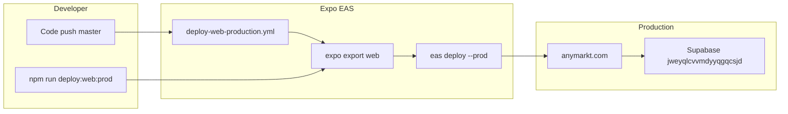

# Web production deploy (Expo / EAS Hosting)

Production web: **https://anymarkt.com**

This project uses Expo Router **server web export** plus **EAS Hosting** for production releases. Server output is required so `https://anymarkt.com/share/...` can render per-link Open Graph HTML for social crawlers.

**Related:** [deploy-beta-approval-notify.md](./deploy-beta-approval-notify.md) · [local-dev-verification.md](./local-dev-verification.md) · [docs/README.md](./README.md)

---

## Architecture



**Native iOS/Android are NOT auto-deployed.** Only web hosting runs on push to `master`.

---

## One-time setup

1. **Dependencies:** `npm install`
2. **EAS login:** `npx eas login`
3. **Project linkage:** `npx eas project:info`
4. **GitHub integration:**
   - Expo dashboard → Project → **GitHub**
   - Install GitHub app; connect `rcdev714/qbet`
   - Confirm workflow [`.eas/workflows/deploy-web-production.yml`](../.eas/workflows/deploy-web-production.yml) appears under **Workflows**
5. **EAS production environment variables** (expo.dev → Environment variables → production):

   | Variable | Value |
   |----------|-------|
   | `EXPO_PUBLIC_APP_URL` | `https://anymarkt.com` |
   | `EXPO_PUBLIC_SUPABASE_URL` | `https://jweyqlcvvmdyyqgqcsjd.supabase.co` |
   | `EXPO_PUBLIC_SUPABASE_KEY` | Project anon / publishable key |
   | `EXPO_PUBLIC_ADMIN_EMAIL` | Admin email(s), comma-separated |
   | `EXPO_PUBLIC_BETA_REQUIRED` | `true` |
   | `EXPO_PUBLIC_LAUNCH_JURISDICTION` | `EC` |
   | `EXPO_PUBLIC_STRIPE_PUBLISHABLE_KEY` | `pk_live_...` or test key for staging |
   | `SUPABASE_SERVICE_ROLE_KEY` | Server routes only — never expose in client |

6. **Supabase production:** link, migrate, deploy functions — see [deploy-beta-approval-notify.md § production](./deploy-beta-approval-notify.md#3-production-walkthrough)

7. **Remove conflicting workflows:** In Expo dashboard, disable any workflow that auto-builds iOS/Android on push. Only **Deploy Web Production** should run on `master`.

---

## Release gates (run before deploy)

```bash
npm run health          # optional local full check
npm run verify          # typecheck + lint + web export + unit + Deno tests
npm run predeploy:prod  # verify + Supabase/Resend infra warnings
```

`predeploy:prod` hard-fails if `verify` fails; Supabase/Resend issues are warnings.

---

## Manual production deploy

```bash
npm run deploy:web:prod
```

This runs:

1. `EXPO_NO_DOTENV=1 npx eas env:exec production "npm run check:web:prod"` (prevents local `.env` from inlining `127.0.0.1:54321`)
   - `tsc --noEmit`
   - `expo lint`
   - `expo export --platform web` → `dist/`
2. `bash scripts/check-prod-export-env.sh` (fails if bundle still references local Supabase)
3. `eas deploy --prod --environment production --export-dir dist`

### Granular commands

| Command | Purpose |
|---------|---------|
| `npm run check:web:prod` | typecheck + lint + export only |
| `npm run web:export:prod` | export only |
| `npm run web:deploy:prod` | deploy existing `dist/` |

---

## Automatic deploy (GitHub → EAS)

**Workflow file:** [`.eas/workflows/deploy-web-production.yml`](../.eas/workflows/deploy-web-production.yml)

```yaml
on:
  push:
    branches: ['master']
jobs:
  deploy_web:
    type: deploy
    environment: production
    params:
      prod: true
```

**Trigger:** every push to `master` on https://github.com/rcdev714/qbet

**Monitor runs:**

```bash
npx eas workflow:list
npx eas workflow:runs --limit 5
```

**Dashboard:** https://expo.dev/projects/5f9fbca3-cb6b-4b24-8918-2717c150019b/hosting/deployments

### What the workflow does NOT do

- `eas build` for iOS or Android
- `eas submit` to App Store / Play Store
- `eas update` OTA bundles

Native releases remain manual:

```bash
eas build --profile production --platform ios
eas build --profile production --platform android
eas submit --profile production --platform ios
```

---

## Supabase production (with every release)

Run when migrations or edge functions changed:

```bash
npx supabase link --project-ref jweyqlcvvmdyyqgqcsjd
npx supabase db push
npx supabase functions deploy send-beta-approval-email
# ... other functions as needed — see scripts/deploy-production.sh
```

Beta approval email secrets (Supabase, not EAS):

```bash
npx supabase secrets set RESEND_API_KEY=re_...
npx supabase secrets set RESEND_FROM_EMAIL="Anymarkt <onboarding@anymarkt.com>"
npx supabase secrets set EXPO_PUBLIC_APP_URL=https://anymarkt.com
```

---

## Post-deploy smoke test

1. https://anymarkt.com/request-access — submit test request
2. https://anymarkt.com/admin/users — approve (admin session)
3. Email arrives from `@anymarkt.com`; link is `https://anymarkt.com/beta/welcome?token=...`
4. Sign up with same email → residence onboarding
5. Share route OG: `https://anymarkt.com/share/market/<id>`

Key static routes exported (verify in build log): `/beta/welcome`, `/request-access`, `/admin/users`, `/onboarding/beta-waitlist`.

---

## Rollback

1. **Expo dashboard** → Hosting → Deployments → promote previous deployment to production
2. Or redeploy known-good commit:
   ```bash
   git checkout <good-sha>
   npm run deploy:web:prod
   ```
3. Database rollbacks are separate — use Supabase migration repair / point-in-time recovery if needed

---

## Troubleshooting

| Issue | Action |
|-------|--------|
| Workflow not triggering | Confirm GitHub repo linked; push is to `master` |
| Workflow fails on export | Run `npm run verify` locally; fix type/lint errors |
| EAS env conflict warning | EAS production vars override local `.env` — intentional |
| `/beta/welcome` 404 | Redeploy web; confirm route in export log |
| Admin approve works but no email | Supabase function + Resend secrets; not an EAS issue |
| Share OG broken | Confirm server export (not static-only); check `+api.ts` routes in `dist/` |
| Supabase Preview / prod migration fails (`42P13` on `get_groups_administered`, or cron `$$` nest in `20260704160000`) | Migrations through `20260704130000` are on prod; `20260704140000`+ rolled back. After merging the migration fix, retry with `npx supabase db push` (or Dashboard → Database → Migrations retry). No repair needed if the failed versions were never recorded. |

---

## Security notes

- Never commit `.env`, `supabase/functions/.env`, or service role keys
- `EXPO_PUBLIC_*` vars are visible in the client bundle
- Admin UI requires `users.is_admin = true` or `EXPO_PUBLIC_ADMIN_EMAIL` match for RPCs
- Security headers for web are in [`vercel.json`](../vercel.json) (used if deploying via Vercel mirror; primary host is EAS)
