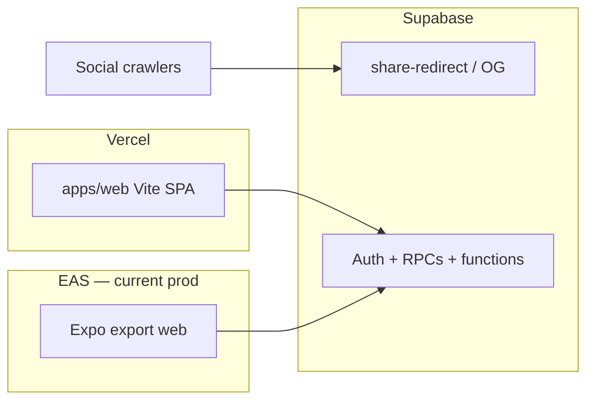

# Vercel deploy — Vite web app (`apps/web`)

Production cutover target for **https://anymarkt.com** after preview validation.
Until DNS cutover, **EAS Hosting remains production** (see [deploy-web-production.md](./deploy-web-production.md)).

**Share/OG:** keep on Edge (`supabase/functions/share-redirect` + existing share-preview patterns). Do not move OG HTML into a Next.js app.

---

## Architecture (target)



---

## One-time: create / link project (RCDEV team)

Team: **RCDEV** (`team_XHyJjb8fwWUYqNoTj34gxY36`). Prefer attaching `rcdev714/qbet` here (Camella already linked).

### Option A — Vercel dashboard

1. Vercel → Add New → Project → Import `rcdev714/qbet`
2. Team: **RCDEV**
3. **Root Directory:** `apps/web`
4. Framework preset: Vite (auto)
5. Build: `npm run build` · Output: `dist` · Install: leave default (runs from root if monorepo detected; otherwise set Install Command to `cd ../.. && npm install`)
6. For npm workspaces, recommended:
   - **Install Command:** `cd ../.. && npm install`
   - **Build Command:** `cd ../.. && npm run build -w @anymarkt/web`
   - **Output Directory:** `dist` (relative to `apps/web`)
7. Add Preview env vars (below). Deploy.

### Option B — CLI

```bash
# from repo root, logged into Vercel under RCDEV
npx vercel link --yes --scope rcdev --project anymarkt-web
# or create:
npx vercel project add anymarkt-web --scope rcdev

# Deploy preview from apps/web (with monorepo install)
cd apps/web && npx vercel --yes
```

Ensure project **Root Directory** is `apps/web` and install runs at repo root so `@anymarkt/shared` resolves.

---

## Environment variables (Vercel)

Client-safe only. Prefer `VITE_*`; `EXPO_PUBLIC_*` also works (Vite `envPrefix` includes both).

| Variable | Preview / Production |
|----------|----------------------|
| `VITE_SUPABASE_URL` | `https://jweyqlcvvmdyyqgqcsjd.supabase.co` |
| `VITE_SUPABASE_KEY` | anon / publishable key |
| `VITE_APP_URL` | Preview URL, then `https://anymarkt.com` |
| `VITE_BETA_REQUIRED` | `true` |
| `VITE_LAUNCH_JURISDICTION` | `EC` |
| `VITE_ADMIN_EMAIL` | admin email(s) |
| `VITE_STRIPE_PUBLISHABLE_KEY` | test or live as appropriate |

Never set `SERVICE_ROLE_KEY` / Stripe secret / Resend on the Vite project.

**Supabase Auth redirect URLs** — add the Vercel preview domain(s) and production:

- `https://*.vercel.app/**`
- `https://anymarkt.com/**` (after cutover)

---

## SPA routing

`apps/web/vercel.json` rewrites unknown paths to `/index.html` so React Router routes (`/login`, `/beta/welcome`, etc.) work on refresh.

---

## DNS cutover (later — do not flip blindly)

1. Confirm Vercel preview parity for auth + beta welcome.
2. Keep EAS workflow until Tim/RC approve cutover.
3. Cloudflare: point apex/`www` from EAS targets → Vercel (DNS only / grey cloud as required).
4. Update `EXPO_PUBLIC_APP_URL` / `VITE_APP_URL` secrets and Supabase Site URL.
5. Leave share/OG on Edge; verify crawler previews still hit share-redirect.
6. Only then disable or pause EAS web auto-deploy.

---

## Local

```bash
npm install
cp .env.example .env   # fill VITE_ or EXPO_PUBLIC_ keys
npm run web:vite       # http://localhost:5173
```
